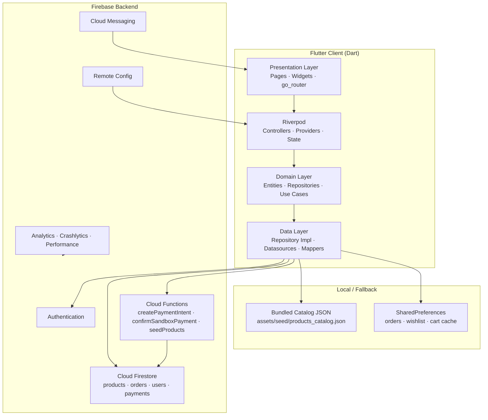
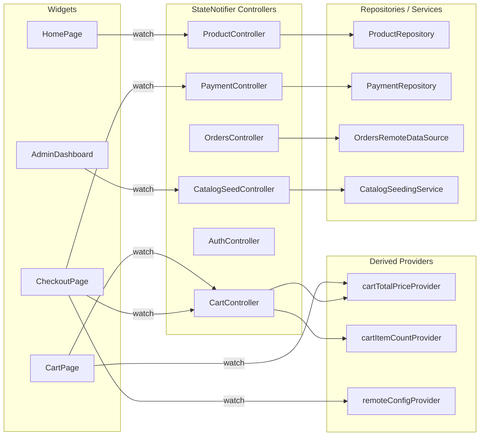
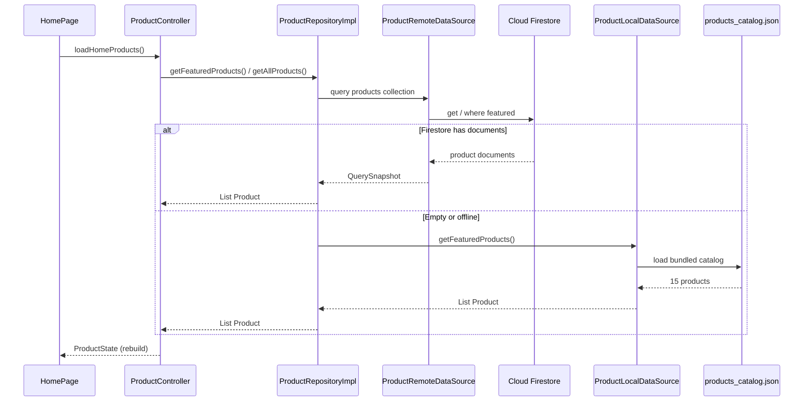
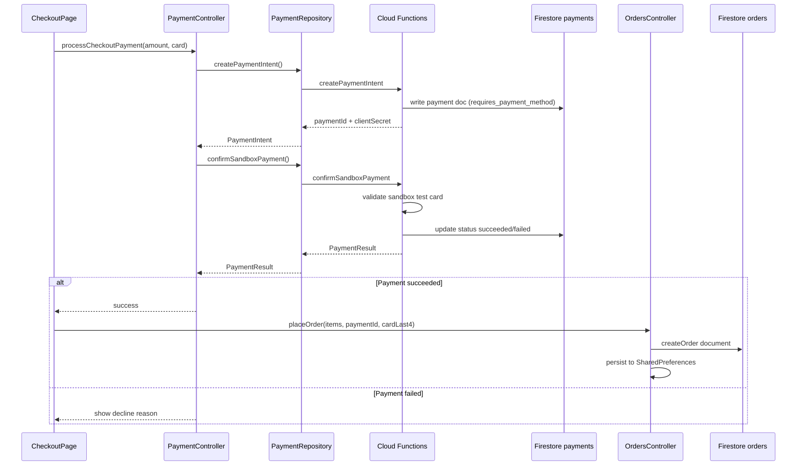
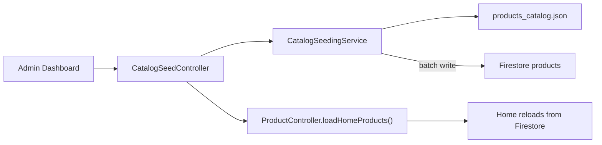

# ShopSphere

A production-quality Flutter e-commerce application built with Clean Architecture, Riverpod, and Firebase.

## Portfolio Note (Important)

This repository is a **recruiter-facing portfolio demo**.

- **No store publishing required**: this app is not intended for Play/App Store submission.
- **Full-stack patterns included**: Firestore rules, Cloud Functions code, admin RBAC, and a sandbox payment flow demonstrate production architecture.
- **Demo-first design**: the app includes **local fallbacks** (catalog + sandbox payment) so it can be reviewed end-to-end without paid Firebase features enabled.

## Features

- Premium Material 3 UI inspired by leading retail apps
- Firebase Authentication (register, login, email verification, password reset)
- Product catalog with Firestore + local fallback catalog
- Featured products with category filtering, shimmer, and empty states
- Product details, wishlist, cart, checkout, and order history
- Search, notifications, profile management
- Role-based admin panel (Customer, Staff, Manager, Admin)
- Firestore & Storage security rules

## Tech Stack

- Flutter / Dart
- Riverpod
- go_router
- Firebase (Auth, Firestore, Storage, Analytics, Crashlytics, Messaging)
- cached_network_image, shimmer, google_fonts

## Getting Started

1. Copy environment config:
   ```bash
   cp .env.example .env
   # Fill in Firebase values from Firebase Console
   ```
2. Copy Android Firebase config (gitignored):
   ```bash
   cp android/app/google-services.json.example android/app/google-services.json
   ```
3. Install and run:
   ```bash
   flutter pub get
   flutter run
   ```

### What works locally (no paid Firebase plan needed)

- **Browse catalog** (Firestore if seeded, otherwise bundled JSON fallback)
- **Cart → Checkout → Sandbox payment** (local simulation when Functions aren’t deployed)
- **Orders** (local cache + Firestore when available)
- **Admin dashboard UI** (RBAC enforced by Firestore rules)

## Testing

```bash
# Unit & widget tests
flutter test

# Integration tests (requires device/emulator)
flutter test integration_test
```

## Portfolio Demo (Phase 14)

See **`docs/PORTFOLIO_DEMO.md`** for recruiter demo flow, Firestore seeding, and sandbox payment test cards.

```bash
flutter run
# Admin Dashboard → Seed Firestore Catalog
# Checkout → pay with 4242 4242 4242 4242
```

## Store Release (Phase 13 — optional)

### Generate signed builds

1. Copy `android/key.properties.example` → `android/key.properties`
2. Create upload keystore (see `store/RELEASE_BUILDS.md`)
3. Run release build:

```powershell
.\scripts\build_release.ps1
```

### Submission guides

| Document | Purpose |
|----------|---------|
| `store/RELEASE_BUILDS.md` | Keystore & signed build steps |
| `store/RELEASE_SUBMISSION.md` | Play Store & App Store upload |
| `store/BETA_TESTING.md` | Internal testing & TestFlight |
| `store/MONITORING_RUNBOOK.md` | Post-launch monitoring |
| `store/BETA_RELEASE_NOTES_v1.0.0.md` | First release notes |

### CI/CD

Push a version tag to trigger release build:
```bash
git tag v1.0.0
git push origin v1.0.0
```

Configure GitHub secrets: `KEYSTORE_BASE64`, `KEY_ALIAS`, `KEY_PASSWORD`, `STORE_PASSWORD`

## Store Release Assets

See the `store/` folder for:
- `STORE_LISTING.md` — Play Store / App Store copy
- `PRIVACY_POLICY.md` — Privacy policy template
- `ACCESSIBILITY_AUDIT.md` — Accessibility compliance notes
- `PERFORMANCE_GUIDE.md` — Profiling & optimization guide
- `RELEASE_BUILDS.md` — Signed build instructions
- `RELEASE_SUBMISSION.md` — Store upload guide
- `BETA_TESTING.md` — Beta testing guide
- `MONITORING_RUNBOOK.md` — Production monitoring

## Firebase Setup

1. Ensure `lib/firebase_options.dart` and `android/app/google-services.json` are configured.
2. Deploy security rules and Cloud Functions:

```bash
firebase deploy --only firestore:rules,storage:rules,firestore:indexes,functions
```

### Firebase deployment constraints (student-friendly)

Some Firebase features may require extra project setup that can involve billing verification:

- **Cloud Functions deployment** may require the **Blaze plan** (even if you stay within the free tier limits).
- **Firebase Storage rules deployment** requires Firebase Storage to be initialized for the project.

This repo is designed so recruiters can still evaluate architecture **without** completing those paid/verified steps.

3. For App Check debug builds, register the debug token in Firebase Console (printed in logcat on first run).
4. Configure Remote Config parameters in Firebase Console (or use defaults):
   - `flash_sale_enabled`, `free_shipping_threshold`, `maintenance_mode`, `promo_banner_text`
5. To enable admin access, set `role` on a user document in Firestore:
   - `customer` (default)
   - `staff`
   - `manager`
   - `admin`

## Security

See **[docs/SECURITY_AUDIT.md](docs/SECURITY_AUDIT.md)** for the full audit report, fixes, and manual action items.

Key setup:
- Copy `.env.example` → `.env` (never commit)
- Deploy `firestore.rules`, `storage.rules`, and Cloud Functions after pulling

## Architecture

ShopSphere is a **full-stack Flutter + Firebase** e-commerce app. The client follows **Clean Architecture** with **Riverpod** for state management. Business logic never lives in widgets; Firebase is accessed only through repository and datasource layers.

For the full development guide and roadmap, see [SHOPSPHERE_AI_GUIDE.md](SHOPSPHERE_AI_GUIDE.md).

### Full-stack overview



| Layer | Responsibility | Examples |
|-------|----------------|----------|
| **Presentation** | UI, navigation, user input | `checkout_page.dart`, `product_card.dart`, `app_router.dart` |
| **State (Riverpod)** | App state, orchestration, derived values | `productControllerProvider`, `cartControllerProvider`, `paymentControllerProvider` |
| **Domain** | Business contracts, entities | `Product`, `OrderEntity`, `PaymentRepository` |
| **Data** | Firebase I/O, mapping, fallbacks | `ProductRepositoryImpl`, `PaymentRemoteDataSource`, `CatalogSeedingService` |
| **Backend** | Auth, persistence, server logic | Firestore rules, callable Cloud Functions |

### State management (Riverpod)

State is centralized in **providers** and **controllers** (`StateNotifier`). Widgets are declarative: they `watch` state and call controller methods for actions.



**Patterns used**

- `StateNotifierProvider` — mutable feature state (cart, orders, products, auth)
- `Provider` — repositories, datasources, and inexpensive derived values
- `ref.watch` in `build` — reactive UI updates
- `ref.read` in callbacks — one-off actions (place order, seed catalog, login)

### API & data flow

#### Product catalog (Firestore + local fallback)



#### Checkout & sandbox payment (Cloud Functions + fallback)



> If Cloud Functions are not deployed, `PaymentRemoteDataSource` falls back to **local sandbox simulation** using the same test cards — so checkout still works in portfolio demos.

#### Firestore catalog seeding (admin)



### Security & backend contracts

- **Firestore rules** — role-based access (`customer` → `admin`); payments are server-write only
- **Callable Functions** — auth-checked server logic for payments, product seeding, order status
- **App Check + Remote Config** — production hardening and runtime feature flags

### Project structure

```
lib/
├── core/                 # Theme, RBAC, Firebase bootstrap, analytics, shared widgets
│   ├── auth/             # Roles, permissions
│   ├── services/         # Firebase, messaging, remote config, performance
│   └── providers/        # App-wide Riverpod providers
├── features/             # Feature modules (each: data / domain / presentation)
│   ├── authentication/
│   ├── home/             # Catalog, featured products, categories
│   ├── catalog/          # Firestore seeding
│   ├── payment/          # Sandbox payment (Clean Architecture)
│   ├── cart/ · checkout/ · orders/
│   ├── wishlist/ · search/ · profile/ · admin/
│   └── ...
├── routes/               # go_router shell + route definitions
└── main.dart

functions/src/            # Cloud Functions (TypeScript)
├── index.ts              # Callable exports + Firestore triggers
├── payments/             # Sandbox payment logic
└── seed/                 # Canonical product seed data

assets/seed/              # Shared product catalog JSON
firestore.rules           # Security rules
```

